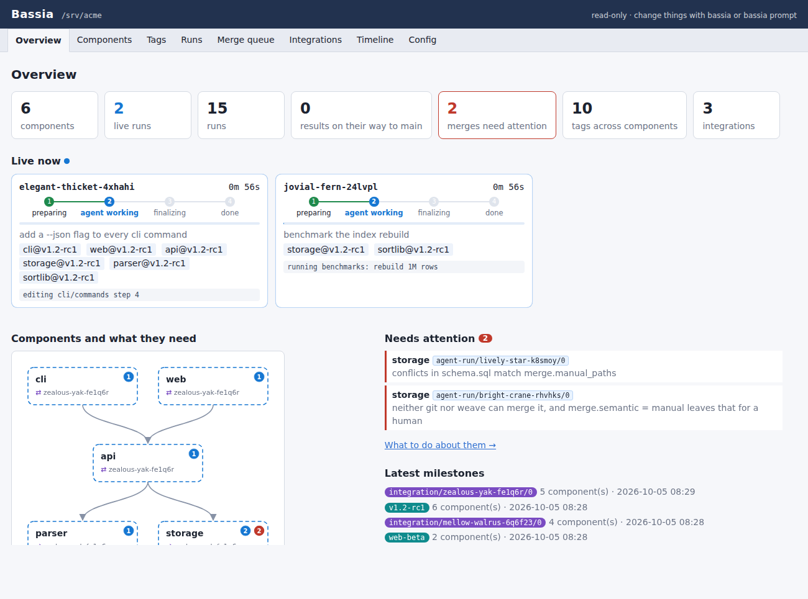
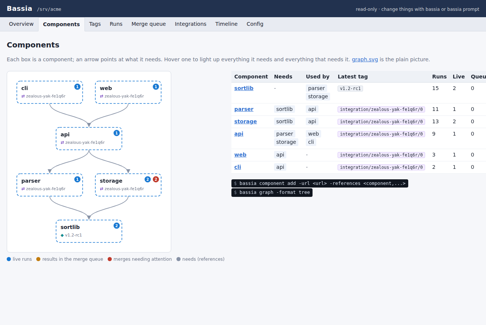
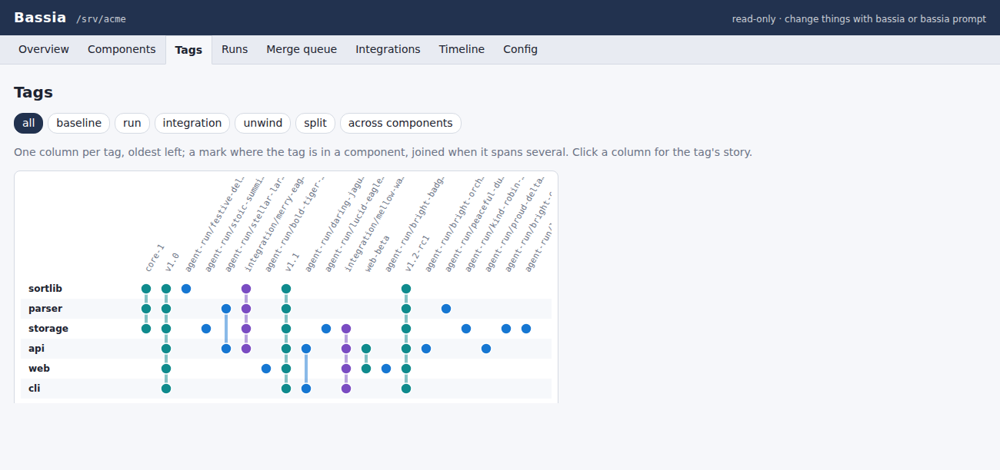
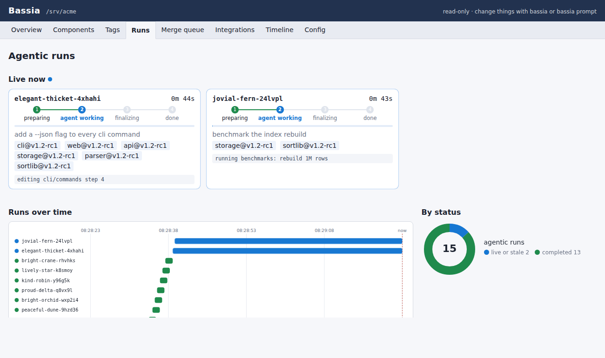
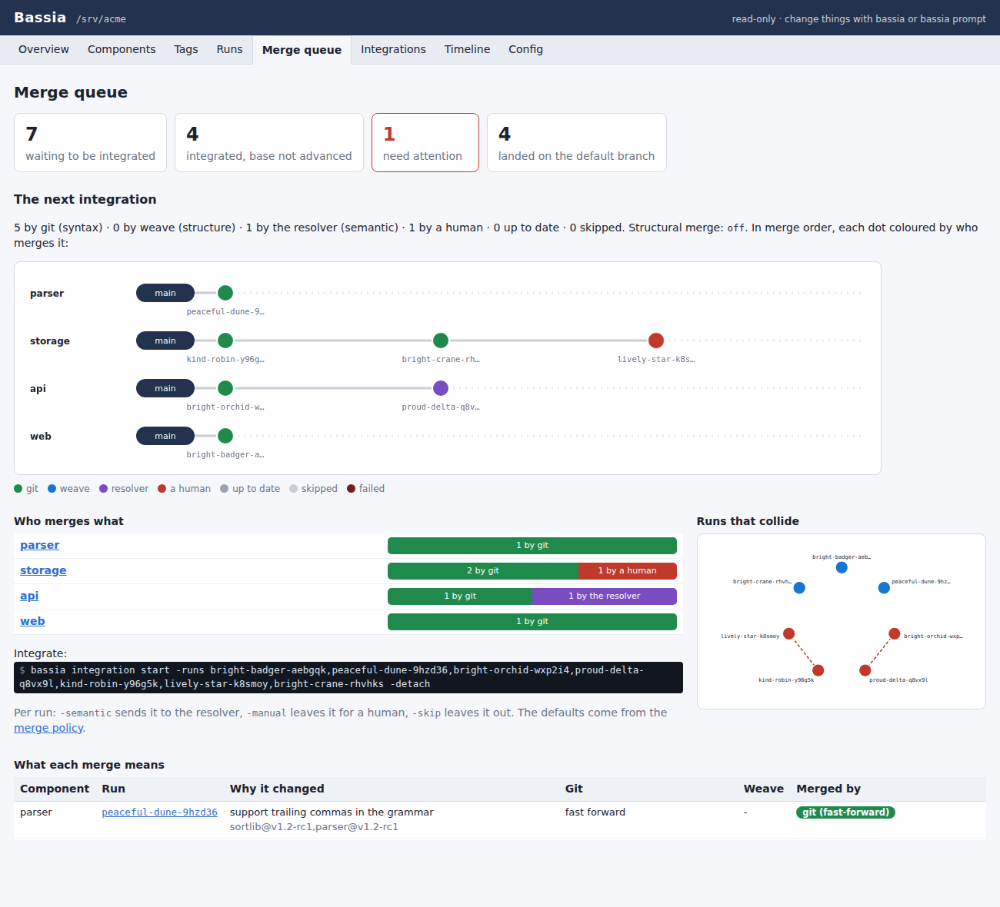
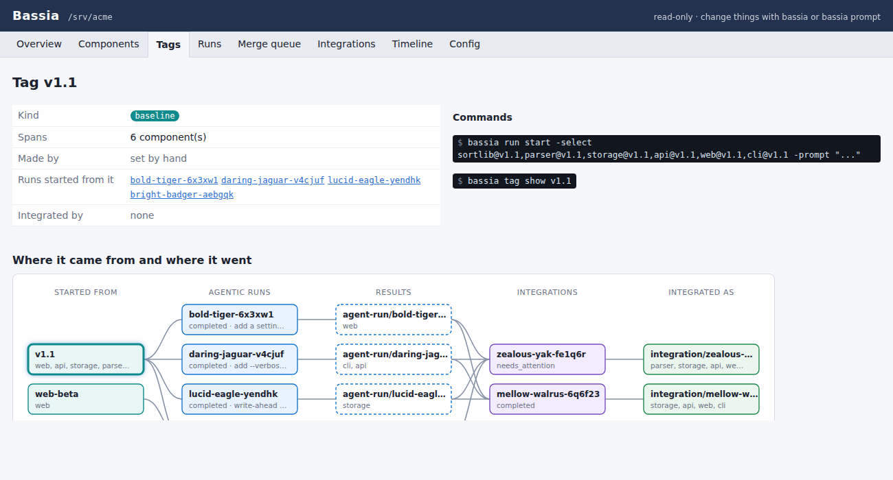
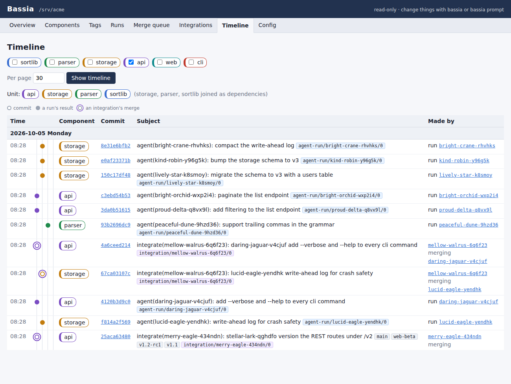

# Bassia

**A monorepo made of git repositories, built for AI agents working in parallel.**

Bassia turns a set of ordinary git repositories into one monorepo. Each repository stays a plain repository that
git, your IDE and your CI already understand. Bassia adds a meta-repo that knows how the repositories depend on
each other. On top of that it runs coding agents in isolated checkouts, and merges their work back with git, a
structural merge, and an LLM that knows *why* each side changed. A local web dashboard lets you watch all of it.



- **[Scales with your code](#a-monorepo-that-scales-and-stays-git)**: work on a handful of components, not a
  checkout of everything. It's git all the way down.
- **[Agentic runs are built in](#agentic-runs-are-built-in)**: many agents, in parallel, each in its own isolated
  checkout, with every result committed, tagged and recorded.
- **[Merges that understand intent](#merges-that-understand-intent)**: git first, then
  [weave](https://github.com/Ataraxy-Labs/weave)'s entity-level merge, then an LLM resolver briefed with both
  sides' prompts. You decide what always needs a human.
- **[A dashboard you look at](#a-dashboard-you-look-at)**: components, tags, runs and the merge queue, drawn as
  pictures and updated live.
- **[A CLI made for agents](#a-cli-made-for-agents)**: every command answers in TOML, and `bassia prompt` takes
  plain English.
- **[Bring your existing repositories](#bring-your-existing-repositories)**: add them as they are; submodules become
  components, and an overgrown repository can be split.

## A monorepo that scales and stays git

A Bassia monorepo is a folder with a meta-repo (`.bassia`) and one git repository per **component**: a library, a
service, an app, a tool. The meta-repo's `components.toml` records which components need which:

```powershell
bassia init -path R:\acme
bassia -C R:\acme component add -url https://github.com/acme/sortlib.git
bassia -C R:\acme component add -url https://github.com/acme/api.git -references sortlib:vendor/sortlib
bassia -C R:\acme graph -format tree
```

The dependencies are what keep it scalable. Whatever you work on, you check out only the components you choose plus
what they need, never the whole monorepo. A component is the unit of scale, of ownership and of access. Because
every component is a real git repository with real history, nothing locks you in: you can push it, review it and
build it the way you do today.



**Tags span components.** One annotated tag of the same name in several components marks a combination that belongs
together: a release, a baseline for agents, the result of an integration. These tags are how you measure progress.

```powershell
bassia tag create v1.1 -select sortlib,parser,storage,api,web,cli -message "Release 1.1"
bassia run start -select sortlib@v1.1,api@v1.1 -prompt "version the REST routes under /v2"
```



## Agentic runs are built in

An **agentic run** gives a coding agent its own workspace. Bassia checks out the components you select, at the tags
or commits you name, and nests the components each one needs where it expects them. It then runs the agent there:
Claude Code by default, or any command you configure. When the agent finishes, Bassia commits each changed
component, tags the result `agent-run/<run>/<n>` and pushes it. Nothing touches `main`. Every run is recorded in the
monorepo's run store, so you can always tell which prompt produced which commit.

```powershell
bassia run start -select api@v1.1,parser@v1.1,storage@v1.1,sortlib@v1.1 -detach -prompt "paginate the list endpoint"
bassia run start -select storage@v1.1,sortlib@v1.1 -detach -prompt "add a write-ahead log" -model opus
bassia run list -status live
bassia run logs <run>          # follow one; also run wait, run stop, run diff -patch
```

Runs are independent processes, so any number can run side by side, started by you or by other agents. Each one is
live-visible, can be followed, waited for or stopped from any shell, and keeps its folder for inspection.



## Merges that understand intent

Agents that work in parallel collide. `bassia integration` brings their results back together in three tiers, and
each tier only gets what the one before it could not merge:

1. **Git** merges what merges cleanly. The triage runs first, without touching a working tree, so you can see in
   advance which results are fast-forwards, clean merges or conflicts, and which runs collide with each other.
2. **[weave](https://github.com/Ataraxy-Labs/weave)**, an entity-level merge driver, resolves conflicts that only
   look like conflicts to git: two runs adding different functions to the same file, or editing different keys of
   the same config.
3. **A semantic resolver** (an LLM, Claude Code by default) gets what's left, with a **semantic brief**: the prompt
   that drove the incoming run, what the runs already integrated were for, the history and diff of both sides, and
   the conflicts with their common ancestor. It merges intent, not lines.

You set the **merge policy**, globally or per component: which conflicts go to the resolver and which always wait
for a human (`merge.manual_paths = **/*.sql`), whether weave's merges with warnings are accepted, and whether a
finished integration lands on `main` by itself. The result is tagged `integration/<key>/<n>` across components.
Nothing moves `main` until you `integration advance`, or until your policy lets it.

```powershell
bassia integration plan -runs all                   # the triage; changes nothing
bassia integration start -runs all -detach          # git, then weave, then the resolver
bassia config set merge.component.storage.semantic -value manual
```



## A dashboard you look at

`bassia web` serves a read-only dashboard on `127.0.0.1`, made to be looked at rather than clicked through:

- **Overview**: live runs, merges that need attention, the latest milestones.
- **Components**: the map of components and what they need.
- **Tags**: each tag's lineage, from baseline to runs to results to integrations.
- **Runs**: every run on a timeline, with live ones animated.
- **Merge queue**: the triage of the next integration and the merges that need a human.
- **Timeline**: commits laid out in one lane per component.
- **Configuration**: every setting, layer by layer.

Every page shows the `bassia` command that does what it describes, one click to copy. Changes go through the
command line or `bassia prompt`. Pages render on the server, need no JavaScript and load nothing from the internet.

| Where a tag came from and where it went | Commits in one lane per component |
| --- | --- |
|  |  |

## A CLI made for agents

Bassia is operated mostly by AI agents, so the command line comes first:

- **Every command answers in TOML**, both success and failure, in one predictable shape, with tables meant for
  people and fields meant for programs.
- **One command table** drives the parser, `help`, error messages and the catalog given to LLMs. They can't drift
  apart.
- **`bassia prompt`** takes plain English. An LLM plans `bassia` commands from it, and Bassia checks each one
  against the command table before it runs. Read-only commands run at once; anything that changes the monorepo is
  confirmed first.
- **Skills**: put reusable instructions in `.bassia/skills/<name>/SKILL.md` ("cut a release", "land everything
  that's green") and invoke them with `/<name>`.
- **Layered configuration**: `.bassia/config.toml` is shared and committed; your own `.bassia/config.user.toml`
  overrides it and is never committed. Both can be changed from the CLI and from `bassia prompt`.

```powershell
bassia prompt which components depend on sortlib?
bassia prompt -dry-run start a run on api and its dependencies that adds rate limiting
bassia prompt /release cut release 1.2 of everything that changed since v1.1
```

## Bring your existing repositories

Your repositories don't need to change to join a Bassia monorepo:

- **Add them as they are.** `bassia component add -url <url>` clones any repository git can clone. Its history, tags
  and branches come along unchanged.
- **Submodules become components.** `component add -unwind` (or `component unwind`) turns git submodules, at any
  depth, into components of their own. Each component gets the right references, and a linking tag reproduces
  exactly the combination of commits the submodules pinned.
- **Split what has grown too big.** `component survey` shows which folders change together. `component split`
  then cuts a repository into several components from a short plan, each part keeping its files' full history,
  renames included.
- **A whole folder of projects** can become one monorepo in a single step. The `bassia-testbed` skill in this
  repository does exactly that for every repository in a development folder.

## Get started

Bassia needs the [.NET SDK 10](https://dotnet.microsoft.com/download) and git 2.38 or later. It is developed on
Windows and tested on Linux.

**With Claude Code**: clone this repository and run `/bassia-install` (or `/bassia-install main` for the latest
code). It builds the newest release tag, or the branch or commit you name, and installs it for your user, side by
side with other versions; `/bassia-use` switches between them. No administrator rights are needed.

**By hand**:

```sh
git clone https://github.com/jk09/bassia && cd bassia
dotnet build
dotnet run --project Bassia -- help
```

Then:

```powershell
bassia init -path R:\acme
bassia -C R:\acme component add -url <your repository>
bassia -C R:\acme web
```

## Learn more

- [The reference](docs/reference.md): every command, the configuration, runs, integration and the dashboard in
  detail.
- [Agentic runs](docs/reference.md#agentic-runs) and
  [integration](docs/reference.md#integration-syntactic-first-then-structural-then-semantic), including
  [the structural merge](docs/reference.md#the-structural-merge-weave).
- [Splitting a component](docs/reference.md#splitting-a-component) and
  [unwinding submodules](docs/reference.md#unwinding-submodules).
- [Building and testing Bassia](docs/reference.md#build).
- [`feat/`](feat/README.md): the feature records that drive Bassia's development, written before the code.
